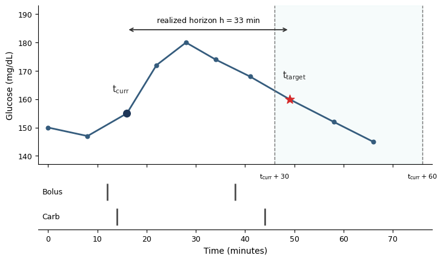
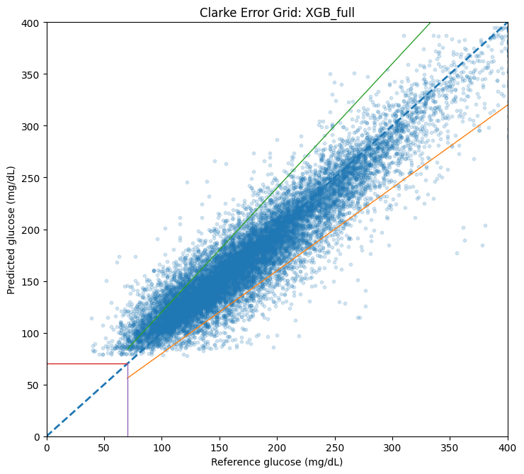
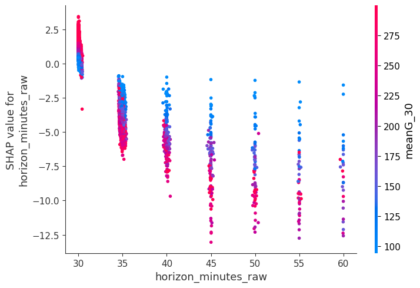
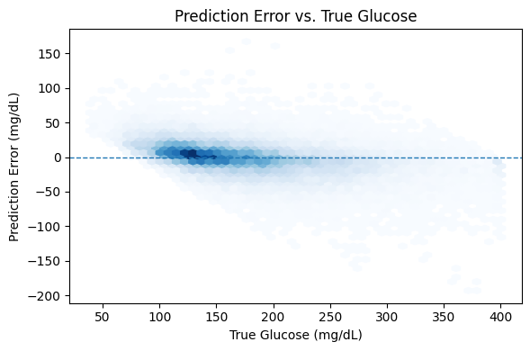

# Event-Driven Modeling for Short-Term Glucose

# Prediction from Irregular CGM-Insulin Data

Lavanya Mandava

Department of Computer Science and Information Systems

Bradley University

Peoria, IL, USA

lmandava@bradley.edu

Guilin Zhao

School of Computing and Artificial Intelligence

Southwest Jiaotong University

Chengdu, China

guilinzhao@swjtu.edu.cn

**Abstract—Accurate short-term glucose forecasting is essential**

**for effective management of type 1 diabetes. Many existing**

**approaches preprocess continuous glucose monitoring (CGM)**

**data using fixed-interval resampling, which can distort temporal**

**relationships between glucose measurements and asynchronous**

**therapy events. In this work, we propose an event-driven mod-**

**eling framework that operates directly on irregularly sampled**

**CGM–insulin pump data without imposing a fixed temporal**

**grid. The formulation constructs prediction targets from observed**

**measurements and supports unified modeling across a 30–60**

**minute forecasting window.**

**Using the DiaTrend dataset, we derive features capturing**

**short-term glucose dynamics and therapy exposure. Experimental**

**results show that a gradient-boosted model achieves a test RMSE**

**of 23.26 mg/dL, corresponding to an 11.8% improvement over a**

**naive baseline and outperforming reduced-feature and baseline**

**models. Approximately 89.3% of predictions fall within Clarke**

**Error Grid Zones A and B. Ablation analysis demonstrates that**

**temporal history features provide the largest performance gains,**

**while horizon encoding yields modest improvements. Additional**

**comparisons with fixed-grid sequence models (LSTM), time-**

**aware recurrent neural models, and a GRU-ODE-style baseline**

**indicate that the proposed event-driven representation remains**

**competitive with or superior to more complex neural architec-**

**tures. These findings suggest that feature representation plays a**

**more critical role than model complexity in glucose prediction**

**from irregular clinical data.**

**Index Terms—glucose forecasting, continuous glucose moni-**

**toring, insulin pump data, irregular time series, event-driven**

**modeling, horizon-aware modeling**

I. INTRODUCTION

Accurate prediction of short-term blood glucose levels is

critical for effective management of type 1 diabetes (T1D).

Forecasting models can support insulin dosing decisions, re-

duce the risk of hypoglycemia and hyperglycemia, and con-

tribute to automated insulin delivery systems [1]–[3]. The in-

creasing availability of continuous glucose monitoring (CGM)

data and integrated insulin pump records has enabled the

development of data-driven approaches for modeling glucose

dynamics [4]–[8].

Husam Ghazaleh

Department of Mathematical and Computational Science

Benedictine University

Lisle, IL, USA

hghazaleh@ben.edu

Rahul Biswa Karma

Department of Computer Science and Information Systems

Bradley University

Peoria, IL, USA

rbiswakarma@mail.bradley.edu

Most existing glucose prediction pipelines for T1D rely

on fixed-grid preprocessing, where CGM measurements are

resampled to regular intervals prior to model training [2], [9].

While this simplifies modeling, it can smooth physiological

dynamics and disrupt the temporal alignment between glucose

measurements and asynchronous therapy events such as insulin

boluses and carbohydrate intake. These limitations motivate

modeling approaches that preserve the native timing of obser-

vations.

In addition, prior work typically formulates glucose pre-

diction as a fixed-horizon task, training separate models for

predefined forecasting intervals [1], [4], [10]. This approach

limits the ability to capture shared predictive structure across

nearby horizons and introduces redundancy in model training.

To address these challenges, we propose an event-driven

modeling framework that operates directly on irregularly

sampled CGM–insulin pump data. The proposed formulation

constructs prediction targets from observed measurements and

supports unified modeling across a 30–60 minute forecasting

window by incorporating the realized prediction horizon (i.e.,

the time interval between the current observation and the

target glucose measurement) as a model feature. More broadly,

this work highlights that in irregular clinical time series,

data representation can have a greater impact on predictive

performance than increasing model complexity alone.

The contributions of this work are as follows:

- An event-driven formulation that preserves native mea-
surement timing and avoids fixed-grid preprocessing.

- A feature representation capturing short-term glucose
dynamics and therapy exposure from irregular data.

- A unified modeling approach across variable prediction
horizons using horizon information as an input feature.

- A systematic empirical evaluation, including ablation
analysis and statistical testing, to quantify the contribu-

tions of feature components.

- An empirical comparison demonstrating that the pro-
posed event-driven representation remains competitive

with or superior to both fixed-grid sequence models and

continuous-time neural baselines.

II. RELATED WORK

Short-term glucose prediction has been widely studied using

data-driven approaches applied to continuous glucose moni-

toring (CGM) data [1], [4]. Early methods relied on linear

models and autoregressive techniques to capture temporal

dependencies in glucose dynamics [1], [4]. More recent work

has explored machine learning and deep learning approaches,

including tree-based models, recurrent neural networks, and

hybrid architectures, which have demonstrated improved pre-

dictive performance under controlled settings [1], [4]–[7], [10].

A common characteristic of many existing pipelines is the

use of fixed-interval preprocessing, where irregularly sam-

pled CGM measurements are resampled onto a uniform time

grid prior to modeling [2], [9], [11]. While this simplifies

model design, it can smooth short-term variability and disrupt

the temporal alignment between glucose measurements and

asynchronous therapy events such as insulin administration

and carbohydrate intake. Several studies have noted that such

preprocessing choices can influence both predictive accu-

racy and interpretability [9]. Modeling irregular time series

without resampling has been studied in other domains using

continuous-time and neural ODE approaches [12]–[15].

In addition to fixed-grid preprocessing, prior work often for-

mulates glucose prediction as a fixed-horizon problem, training

separate models for predefined forecasting intervals (e.g., 30

or 60 minutes ahead) [10]. While fixed-grid preprocessing

affects how input data are represented in time, fixed-horizon

formulations constrain how prediction targets are defined.

Although this approach is straightforward, it limits the ability

to share information across nearby horizons and increases the

complexity of model deployment. Some recent efforts have

explored multi-horizon prediction strategies [4], [10], but these

approaches often still rely on discretized horizon definitions or

fixed-grid representations.

Beyond temporal structure and horizon formulation, another

important aspect of glucose prediction is the incorporation

of contextual information, including recent glucose history,

insulin dosing, and carbohydrate intake. Studies consistently

show that short-term temporal features derived from recent

measurements play a dominant role in predictive performance

[2], [16]. However, the relative contribution of feature repre-

sentation versus model architecture remains an open question,

particularly in settings with irregular sampling.

In this work, we differ from prior approaches by adopting

an event-driven formulation that operates directly on irregular

CGM–insulin pump data without fixed-grid resampling. In

addition, we encode the realized prediction horizon as a

continuous feature, enabling unified modeling across a range

of forecasting intervals. Our evaluation focuses on disen-

tangling the contributions of feature representation, horizon

encoding, and model complexity through systematic ablation

and statistical analysis.

III. DATASET AND EVENT-DRIVEN FORMULATION

We conduct our experiments using the publicly available

DiaTrend dataset, which contains integrated records from

continuous glucose monitoring (CGM) devices and insulin

pump systems for individuals with T1D [16]. The full dataset

includes data from 54 individuals across two cohorts, compris-

ing over 27,000 days of CGM measurements and more than

8,000 days of insulin pump data. Because data availability

varies across subjects, we focus on a subset of individuals with

sufficient CGM, insulin, and carbohydrate records required

for joint modeling of glucose dynamics and therapy events.

After preprocessing and filtering for subjects with sufficient

multimodal records, this results in a cohort of 17 subjects used

in our experiments, as summarized in Table I.

Because these signals are generated by different devices

and user interactions, the resulting data are not perfectly

synchronized: CGM measurements may contain gaps or tim-

ing irregularities, while therapy events occur asynchronously

relative to glucose measurements. This yields an irregular

multimodal time series that is not naturally aligned to a fixed

temporal grid [2], [9], [11], [13], [14].

Recent

work

on

irregular

time

series

has

explored

continuous-time modeling approaches, including time-aware

recurrent networks and neural ordinary differential equation

(ODE) frameworks such as ODE-RNN and GRU-ODE [13],

[14]. These models explicitly account for irregular sampling by

modeling latent state evolution between observations. While

such approaches provide a principled framework for handling

irregular data, they introduce additional modeling complexity

and training challenges. In this work, we evaluate whether such

complexity is necessary for short-term glucose prediction by

comparing continuous-time neural models with simpler event-

driven representations.

For each current timestamp tcurr (the time of an observed

CGM measurement), we define a candidate prediction target

by searching forward in time for the first future CGM mea-

surement occurring at or beyond 30 minutes. If that future

observation occurs within 60 minutes of tcurr, the pair is

retained as a valid event-level sample. Let ttarget denote the

selected future timestamp. The realized prediction horizon is

then defined as

h = ttarget −tcurr,

with h ∈[30, 60] minutes by construction. The prediction

target for the sample is the glucose value observed at ttarget.

To illustrate the event-driven target construction process,

Figure 2 shows an example of how prediction targets are

selected from observed CGM measurements.

As shown in Figure 2, the prediction target is defined

directly from observed future measurements rather than from

interpolated or fixed-interval resampled values. This ensures

that each training sample reflects the true temporal spacing

of the underlying data and avoids distortions introduced by

fixed-grid preprocessing.

**Event-Driven Target**

**Integrated Diabetes Data**

**Feature Construction**

**Construction**

**(shared across models)**

CGM glucose measurements

Select first future CGM reading

Basal insulin

Bolus insulin

Carbohydrate intake

_Glucose history (trends, rolling stats)_

within 30–60 min window

Therapy exposure (insulin, carbs)

Time-based features

Realized horizon (h)

*Fig. 2.*

Fig. 2.

Illustration of event-driven target construction. For a given current

timestamp tcurr, the first future CGM measurement within the 30–60 minute

window is selected as the prediction target. The time difference defines the

realized prediction horizon h.

This event-driven construction produces a unified dataset

spanning a continuous 30–60 minute forecasting window with-

out requiring separate target-generation procedures for differ-

ent horizons. It also ensures that the target always corresponds

to an actually observed future glucose measurement. Figure 1

illustrates the overall framework.

The final event-level dataset is evaluated using subject-level

partitioning so that the same individual does not appear in

more than one split. This design supports evaluation on pre-

viously unseen subjects and reduces cross-subject information

leakage. As discussed later in the Results section, the realized

horizon distribution is highly imbalanced toward shorter inter-

vals, with the majority of retained samples occurring near the

lower end of the 30–60 minute window. This imbalance is an

inherent consequence of the observed sampling structure and

is therefore treated explicitly in the empirical analysis rather

than removed through artificial resampling.

IV. FEATURE REPRESENTATION

For each event-level sample defined at a current timestamp

tcurr, we construct a feature vector capturing glucose history,

therapy exposure, and temporal context. The feature design

emphasizes short-term glucose trends and variability derived

directly from irregularly sampled observations, without requir-

ing interpolation or resampling.

_A. Glucose History Features_

Short-term glucose dynamics are captured using CGM

measurements observed prior to tcurr, including both the

**Predictive Models**

XGB variants (primary model)

**Horizon Encoding**

**Evaluation**

MLP (event-level baseline)

Include horizon as a feature

Fixed-grid LSTM

Time-aware GRU

RMSE, MAE, MedAE

Clarke Error Grid

(Optional feature interactions)

GRU-ODE

Linear regression & naive baselines

most recent value immediately preceding tcurr and short-

term history over preceding time intervals. These features

summarize both absolute levels and local trends in glucose

behavior. Specifically, we compute:

- Recent glucose values preceding tcurr
- Short-term differences (e.g., change over recent mea-
surements defined over time intervals rather than fixed

indices)

- Rolling statistics, including mean and standard deviation
over recent time windows (in minutes)

These features provide a compact representation of local

glucose trajectories and are computed directly from observed

timestamps without resampling, ensuring that temporal rela-

tionships reflect the original irregular sampling structure.

_B. Therapy and Event Features_

To account for external interventions, we include features

derived from insulin delivery and carbohydrate intake. These

include:

- Aggregated basal and bolus insulin over recent time
windows (in minutes)

- Carbohydrate intake events prior to tcurr
- Time since last insulin or meal event (in minutes)
These variables provide contextual information about recent

therapy actions that influence future glucose levels.

_C. Time-Based Features_

Temporal context is incorporated through features describ-

ing the timing of each event. These include:

- Time of day (e.g., hour of day)
- Elapsed time since the previous CGM observation (in
minutes)

Such features help capture periodic patterns and temporal

variability in glucose behavior.

_D. Horizon Feature_

In addition to history and therapy features, we include the

realized prediction horizon h as a model input. This enables

a single model to operate across a continuous 30–60 minute

forecasting window.

Importantly, horizon information is incorporated as a stan-

dard input feature rather than through explicit interaction

terms. As shown in the Results section, including h provides

modest improvements in predictive performance, while the

majority of performance gains arise from history-based fea-

tures. This observation is further supported by the ablation

analysis presented in Section VI.

Fig. 1. Overview of the proposed event-driven glucose prediction framework. The pipeline operates directly on irregular CGM–insulin data without fixed-grid

resampling. Prediction targets are constructed from observed future CGM measurements within a 30–60 minute window, and the realized prediction horizon

is incorporated as a model feature.

_E. Feature Design Considerations_

All features are constructed using only information available

up to tcurr, ensuring that no future information is used during

training. This design avoids information leakage and maintains

consistency between training and inference.

Overall, the feature representation is designed to balance

expressiveness and robustness, capturing short-term glucose

patterns while remaining compatible with irregular sampling

and event-driven target construction.

V. MODELING AND EXPERIMENTAL SETUP

_A. Model Architectures_

To evaluate the proposed event-driven feature representa-

tion, we consider multiple model classes with varying levels

of complexity.

Our primary model is a gradient-boosted decision tree

model (XGBoost) [17], which is well-suited for tabular data

and has demonstrated strong performance in clinical prediction

tasks.

To assess whether the benefits of the proposed representa-

tion generalize across model families, we additionally include

a multilayer perceptron (MLP) operating on the same event-

level features. This provides a simple neural baseline for

evaluating the representation beyond tree-based methods.

We also include sequence-based neural baselines to compare

against both fixed-grid and irregular-time modeling strategies.

A fixed-grid long short-term memory (LSTM) model is trained

on input sequences obtained by resampling CGM measure-

ments to a fixed temporal grid, representing a conventional

resampling-based pipeline. A time-aware gated recurrent unit

(GRU) model incorporates elapsed-time information directly

to account for irregular sampling [12]. Finally, we include a

GRU-ODE-style model that evolves hidden states between ob-

servations, providing a representative continuous-time baseline

for irregular time series modeling [14], [15].

Together, these models enable comparison between event-

driven tabular methods, fixed-grid sequence models, and

continuous-time neural approaches.

_B. Model Variants_

To isolate the contributions of different feature components,

we define several XGBoost-based model variants:

- XGB-Full: Full feature set including history, therapy,
time-based features, and horizon.

- XGB-HN: Horizon-aware model without explicit feature
interaction terms.

- XGB-NoH: Model excluding the horizon feature.
- XGB-Reduced: Model using a reduced feature set that
excludes glucose history features, retaining only therapy,

time-based, and horizon features.

- XGB-Full-W: Weighted model that emphasizes longer-
horizon samples during training.

These variants allow us to quantify the relative importance

of temporal history features, horizon information, and sample

weighting.

TABLE I

PARTITION SUMMARY AFTER EVENT-DRIVEN SAMPLE CONSTRUCTION.

Partition

Subjects

Samples

Mean target

(mg/dL)

Target SD

(mg/dL)

Train

12

271,694

163.59

58.17

Validation

2

32,645

171.24

61.86

Test

3

48,649

172.05

61.88

_C. Training Procedure_

All models are trained using subject-level data partitions to

ensure that no individual appears in more than one split. This

design supports evaluation on previously unseen subjects and

reduces the risk of overfitting to subject-specific patterns.

For the event-driven tabular models, hyperparameters for

XGBoost are selected based on validation performance. The

MLP baseline is trained on the same event-level features using

standard optimization settings with a fixed architecture and

learning rate.

For sequence-based baselines, the fixed-grid LSTM is

trained on these resampled input sequences, whereas the

time-aware GRU and GRU-ODE-style models are trained on

irregular event sequences using elapsed-time information. All

models are trained using only information available up to tcurr,

consistent with the event-driven formulation.

Random seeds are fixed where applicable to improve repro-

ducibility across runs.

_D. Evaluation Metrics_

Model performance is evaluated using multiple complemen-

tary metrics commonly used in regression tasks [18]:

- Root Mean Squared Error (RMSE)
- Mean Absolute Error (MAE)
- Median Absolute Error (MedAE)
To assess clinical relevance, we additionally evaluate pre-

dictions using the Clarke Error Grid [19], which categorizes

predictions based on their potential clinical impact.

_E. Statistical Evaluation_

To assess the reliability of observed performance differ-

ences, we conduct statistical comparisons using bootstrap re-

sampling and paired tests. Confidence intervals for RMSE are

computed using bootstrap sampling on the test set. Paired com-

parisons between models are evaluated using both bootstrap-

based tests and the Wilcoxon signed-rank test [20].

_F. Implementation Details_

All models are implemented in Python (version 3.12) us-

ing standard machine learning libraries. Feature construction,

model training, and evaluation are performed using a consis-

tent pipeline to ensure reproducibility.

TABLE II

MAIN PREDICTIVE PERFORMANCE ON THE TEST SET. RMSE

IMPROVEMENT IS COMPUTED RELATIVE TO THE NAIVE BASELINE.

Model

RMSE

(mg/dL)

MAE

(mg/dL)

MedAE

(mg/dL)

RMSE

improvement

XGB-HN

**23.253**

**16.956**

12.436

**11.9%**

XGB-Full

23.262

16.969

**12.430**

11.8%

XGB-NoH

23.299

16.997

12.462

11.7%

XGB-Full-W

23.912

17.496

12.916

9.4%

XGB-Reduced

25.799

19.100

14.368

2.2%

Linear Regression

25.809

19.093

14.327

2.2%

Naive

26.386

19.274

13.991

- 
VI. RESULTS

_A. Overall Predictive Performance_

Table II summarizes predictive performance across the pri-

mary models. The strongest overall performance is obtained by

the horizon-aware XGBoost variants, with XGB-HN achieving

the lowest RMSE of 23.253 mg/dL and XGB-Full achieving a

statistically comparable RMSE of 23.262 mg/dL. Both models

substantially outperform XGB-Reduced, Linear Regression,

and the Naive baseline. Relative to the Naive model, XGB-Full

reduces RMSE by 11.8%, whereas XGB-Reduced improves

RMSE by only 2.2%. These results indicate that the largest

gains arise from history-based temporal features.

The MLP baseline (Table III) achieves competitive perfor-

mance, outperforming XGB-Reduced and approaching the best

XGBoost models. This suggests that the proposed representa-

tion benefits both tree-based and neural architectures, though

it is most effectively leveraged by gradient-boosted models.

_B. Comparison with Fixed-Grid, Event-Level Neural, and_

_Continuous-Time Models_

To evaluate whether more complex temporal models pro-

vide additional predictive accuracy, we compare the proposed

event-driven approach with both fixed-grid baselines (XGB-

FixedGrid and LSTM) and irregular-time neural baselines

_(GRU and GRU-ODE)._

Table III summarizes the performance of these models.

The fixed-grid LSTM baseline underperforms the event-driven

XGBoost models, indicating that resampling-based sequence

modeling does not provide advantages in this setting. The

time-aware GRU model, which incorporates elapsed-time in-

formation directly, performs substantially worse, suggesting

that naive handling of irregular sampling is insufficient for

accurate prediction.

The GRU-ODE-style model improves over simpler se-

quence baselines such as the time-aware GRU and fixed-

grid LSTM, demonstrating the value of explicitly modeling

temporal dynamics between observations. However, it does not

outperform the event-driven XGBoost models. These results

indicate that the proposed feature representation captures the

relevant temporal structure effectively, even when compared

to more complex continuous-time neural architectures.

TABLE III

COMPARISON WITH FIXED-GRID AND CONTINUOUS-TIME NEURAL

MODELS ON THE TEST SET.

Model

RMSE

(mg/dL)

MAE

(mg/dL)

MedAE

(mg/dL)

XGB-HN

**23.253**

**16.956**

12.436

XGB-Full

23.262

16.969

**12.430**

XGB-FixedGrid

23.440

17.120

12.650

MLP

23.388

16.833

12.124

LSTM (fixed-grid)

23.910

17.300

12.800

GRU (time-aware)

30.700

22.500

17.200

GRU-ODE

23.690

17.200

12.700

TABLE IV

ABLATION STUDY OF THE HORIZON-AWARE REPRESENTATION. NOH: NO

HORIZON FEATURE. HN: HORIZON-AWARE WITHOUT EXPLICIT

INTERACTION TERMS. FULL-W: WEIGHTED FULL MODEL.

Model

Horizon

History

Interactions

XGB-HN

Yes

Yes

No

XGB-Full

Yes

Yes

Yes

XGB-NoH

No

Yes

No

XGB-Full-W

Yes

Yes

Yes

XGB-Reduced

Yes

No

No

Linear Regression

Yes

No

No

Naive

No

No

No

Overall, these findings suggest that increasing model com-

plexity alone does not guarantee improved performance, and

that appropriate representation of irregular clinical data plays

a more critical role.

_C. Ablation Analysis_

To isolate the contributions of the main representation com-

ponents, Table IV compares models with and without horizon

information, temporal history features, and explicit interaction

terms. Removing history-based temporal features causes the

largest degradation in performance, increasing RMSE from

23.262 mg/dL to 25.799 mg/dL. These results indicate that

short-term glucose dynamics and recent therapy exposure

provide the dominant predictive signal in this setting.

Removing the horizon feature yields a smaller increase in

RMSE, from 23.262 mg/dL to 23.299 mg/dL, indicating that

horizon encoding provides only a modest aggregate accuracy

gain. This suggests that the practical value of horizon infor-

mation lies more in supporting unified multi-horizon modeling

than in substantially reducing average prediction error. Explicit

horizon–feature interaction terms do not improve final perfor-

mance, as XGB-HN slightly outperforms XGB-Full.

_D. Statistical Reliability_

Bootstrap confidence intervals and paired significance tests

are reported in Tables V and VI. The confidence intervals

of XGB-Full and XGB-HN overlap strongly, consistent with

their nearly identical RMSE values. Paired bootstrap testing

shows no significant difference between these two variants

TABLE V

BOOTSTRAP RMSE CONFIDENCE INTERVALS ON THE TEST SET.

Model

RMSE

(mg/dL)

95% CI low

(mg/dL)

95% CI high

(mg/dL)

Naive

26.386

26.153

26.624

Linear Regression

25.809

25.593

26.048

XGB-Reduced

25.803

25.589

26.033

XGB-HN

**23.261**

23.036

23.482

XGB-NoH

23.306

23.077

23.530

XGB-Full

23.270

23.047

23.493

XGB-Full-W

23.913

23.683

24.135

TABLE VI

PAIRED STATISTICAL COMPARISONS AGAINST XGB-FULL.

Comparison

Bootstrap p Wilcoxon p

Full vs NoH

0.0000

< 0.0001

Full vs HN

0.3413

n.s.

Full vs Reduced

0.0000

< 0.0001

Full vs Linear

0.0000

< 0.0001

Full vs Full-W

0.0000

< 0.0001

(p = 0.3413), while both XGB-Full and XGB-HN signifi-

cantly outperform XGB-Reduced, Linear Regression, and the

weighted model. Although the difference between XGB-Full

and XGB-NoH is statistically significant, the absolute per-

formance gap is small, indicating limited practical impact of

horizon encoding on aggregate RMSE. These results support

the conclusion that temporal history features are essential,

whereas explicit interaction terms do not provide additional

benefit in the final experiments.

_E. Clinical Evaluation_

Figure 3 and Table VII summarize the Clarke Error Grid

analysis for XGB-Full. Overall, 89.27% of predictions fall

within Zones A and B, indicating clinically acceptable per-

formance. Specifically, 78.79% of predictions fall in Zone A

and 10.49% in Zone B. However, 6.76% of predictions fall in

Zone D, indicating that clinically important errors remain non-

negligible. Thus, while the overall clinical profile is favorable,

the model should not be interpreted as fully robust in safety-

critical conditions.

_F. Performance Across Clinical Glucose Ranges_

Table VIII reports RMSE stratified by target glucose

range. The lowest error for XGB-Full is observed in the in-

range region (70–180 mg/dL), where it achieves an RMSE

of 20.142 mg/dL. Error increases substantially in hyper-

glycemia (26.715 mg/dL) and is highest in hypoglycemia

(37.813 mg/dL). This pattern is consistent with the greater

physiological variability and relative scarcity of low-glucose

events [2], [16]. Importantly, horizon reweighting (assigning

higher loss weights to samples with longer prediction hori-

zons) does not improve performance in any range and slightly

worsens hypoglycemia performance. Notably, the naive base-

line achieves the lowest RMSE in the hypoglycemic range,

*Fig. 3.*

Fig. 3.

Clarke Error Grid for the XGB-Full model on the test set. Most

predictions fall within clinically acceptable Zones A and B.

TABLE VII

CLARKE ERROR GRID DISTRIBUTION FOR XGB-FULL ON THE TEST SET.

Zone

Count

Percent

A

38,328

78.785

B

5,103

10.489

C

1,930

3.967

D

3,288

6.759

E

0

0.000

A+B

43,431

**89.274**

indicating that all learned models remain limited in this safety-

critical regime.

_G. Performance Across Realized Horizons_

The realized horizon distribution is highly imbalanced, with

47,656 of 48,649 test samples falling in the 30–35 minute

range and only 187 samples in the 45–60 minute range.

Table IX shows that error increases sharply with longer

horizons. For XGB-Full, RMSE rises from 22.967 mg/dL

at 30–35 minutes to 33.411 mg/dL at 35–45 minutes and

39.144 mg/dL at 45–60 minutes. These results indicate that

overall performance is primarily driven by shorter-horizon

forecasts due to the strong imbalance in the dataset.

Reweighting longer horizons does not improve perfor-

mance; the weighted model performs worse overall and

within each horizon bucket. This suggests that simple inverse-

frequency weighting is insufficient to overcome the extreme

scarcity of longer-horizon samples in the current dataset.

_H. Error Analysis and Interpretation_

Figure 4 shows the SHAP summary plot for XGB-Full.

The most influential features are dominated by glucose his-

TABLE VIII

RMSE (MG/DL) ACROSS TARGET GLUCOSE RANGES. LR: LINEAR

REGRESSION; RED: XGB-REDUCED; NOH: XGB-NOH; FULL:

XGB-FULL.

Range

N

Naive

LR

Red

NoH

Full

Hypo (< 70)

408

33.183 37.469 37.494 37.435 37.813

In-range (70–180) 28,209 18.355 22.779 22.768 20.174 20.142

Hyper (> 180)

20,032 34.191 28.116 28.139 26.866 26.715

TABLE IX

RMSE (MG/DL) ACROSS REALIZED HORIZON BUCKETS. LR: LINEAR

REGRESSION; RED: XGB-REDUCED; NOH: XGB-NOH; FULL:

XGB-FULL.

Bucket

N

Naive

LR

Red

NoH

Full

30–35

47,656 26.185 25.580 25.572 23.001 22.967

35–45

806

34.406 37.028 37.003 33.790 33.411

45–60

187

40.183 43.137 42.949 39.403 39.144

tory variables, confirming the central role of recent glucose

dynamics in prediction. Horizon-related variables contribute

additional signal but are not among the dominant drivers of

model performance. This is consistent with the ablation results,

which show that history features matter substantially more

than explicit horizon encoding in terms of aggregate RMSE.

SHAP values are computed using the TreeSHAP method [21],

which provides consistent feature attribution for tree-based

models.

Figure 5 shows that the largest absolute errors are concen-

trated in extreme glycemic ranges, particularly low glucose

values, and in longer-horizon cases.

VII. DISCUSSION

The results of this study highlight the importance of feature

representation in short-term glucose prediction from irregular

clinical data. Across all experiments, the largest improvements

in predictive performance are driven by features capturing

recent glucose dynamics and therapy exposure. In contrast,

increasing model complexity alone yields relatively limited

gains when the underlying feature representation is weak.

The comparison with neural baselines provides additional

insight into the role of model complexity. While continuous-

time models such as the GRU-ODE-style architecture capture

irregular temporal dynamics more explicitly, they do not

outperform the proposed event-driven approach. Moreover, the

strong performance of XGBoost relative to both sequence-

based and continuous-time models suggests that the pro-

posed feature representation is effective across different model

classes. The poor performance of the time-aware GRU further

indicates that naive incorporation of elapsed-time information

is insufficient, highlighting the importance of carefully de-

signed feature representations.

The ablation analysis provides further insight into the role of

different components of the proposed framework. Removing

temporal history features leads to a substantial degradation

in performance, confirming that short-term glucose trends

*Fig. 4. SHAP summary plot for the XGB-Full model. Glucose history fea-*

Fig. 4. SHAP summary plot for the XGB-Full model. Glucose history fea-

tures dominate predictive importance, while horizon-related features provide

smaller additional contributions.

*Fig. 5.*

Fig. 5.

Prediction error versus target glucose for the XGB-Full model.

Darker regions indicate higher concentrations of predictions. Larger errors

are concentrated in extreme glycemic ranges, particularly in hypoglycemia.

are the dominant predictors in this setting. Incorporating the

prediction horizon as a feature yields modest improvements

and enables unified modeling across a continuous forecasting

window. However, explicit interaction terms between horizon

and other features do not provide additional benefit in the

evaluated models, suggesting that tree-based methods can cap-

ture relevant nonlinear relationships without requiring explicit

feature interaction engineering (e.g., manually constructing

interaction terms between horizon and other variables). The

primary value of horizon encoding is enabling unified model-

ing across variable prediction intervals rather than improving

aggregate accuracy.

The evaluation across glycemic ranges reveals that predic-

tive performance is highest in the in-range region and degrades

in both hypoglycemia and hyperglycemia. In particular, hy-

poglycemic events remain challenging to predict, which is

consistent with their relative rarity and higher physiological

variability. This limitation is also reflected in the Clarke Error

Grid analysis, where a non-negligible fraction of predictions

fall into higher-risk regions. These findings indicate that, while

overall predictive accuracy is strong, further improvements are

needed to ensure reliability in safety-critical scenarios.

Analysis across realized prediction horizons shows a clear

increase in error as the forecasting interval grows. However,

the dataset is highly imbalanced toward shorter horizons,

with the majority of samples concentrated near 30 minutes.

As a result, aggregate performance metrics are primarily

driven by shorter-horizon predictions. Attempts to correct this

imbalance using simple reweighting strategies do not improve

performance, suggesting that more sophisticated approaches

or additional data may be required to improve long-horizon

predictions.

This study has several limitations. First, the dataset size

includes only 17 subjects, which may limit generalization

across broader patient populations and should be addressed

in future work with larger cohorts. Second, the distribution of

prediction horizons is highly skewed, limiting the ability to

learn robust patterns for longer horizons. Third, the evaluation

focuses on a specific set of model classes and feature designs,

and additional architectures or domain-specific features may

yield further improvements.

Despite these limitations, the proposed event-driven formu-

lation provides a flexible and conceptually simple approach

for modeling irregular CGM–insulin data without imposing

fixed-grid preprocessing. By preserving the native timing of

observations, the framework avoids distortions introduced by

resampling and enables consistent modeling across variable

prediction intervals.

REFERENCES

[1] E. I. Georga, V. C. Protopappas, D. Ardig`o, M. Marina, I. Zavaroni, and

D. Polyzos, “Multivariate prediction of subcutaneous glucose concen-

tration in type 1 diabetes patients based on support vector regression,”

_IEEE Journal of Biomedical and Health Informatics, vol. 17, no. 1, pp._

71–81, 2013.

[2] G. Cappon, M. Vettoretti, G. Sparacino, and A. Facchinetti, “Continuous

glucose monitoring sensors for diabetes management: a review of

technologies and applications,” Diabetes & Metabolism Journal, vol. 43,

no. 4, pp. 383–397, 2019.

[3] A. Y. Alhaddad, H. Aly, H. Gad, A. Al-Ali, K. K. Sadasivuni, J.-

J. Cabibihan, and R. A. Malik, “Sense and learn: recent advances in

wearable sensing and machine learning for blood glucose monitoring

_and trend-detection,” Frontiers in Bioengineering and Biotechnology,_

vol. 10, p. 876672, 2022.

[4] A. Aliberti, I. Pupillo, S. Terna, E. Macii, S. D. Cataldo, E. Patti, and

A. Acquaviva, “A multi-patient data-driven approach to blood glucose

prediction,” IEEE Access, vol. 7, pp. 69 311–69 325, 2019.

[5] J. Xie and Q. Wang, “Benchmarking machine learning algorithms on

blood glucose prediction for type 1 diabetes in comparison with classical

_time-series models,” IEEE Transactions on Biomedical Engineering,_

vol. 67, no. 11, pp. 3101–3124, 2020.

[6] H. N. Mhaskar, S. V. Pereverzyev, and M. D. van der Walt, “A deep

learning approach to diabetic blood glucose prediction,” Frontiers in

_Applied Mathematics and Statistics, vol. 3, p. 14, 2017._

[7] K. Liu, L. Li, Y. Ma, J. Jiang, Z. Liu, Z. Ye, S. Liu, C. Pu, C. Chen, and

Y. Wan, “Machine learning models for blood glucose level prediction

in patients with diabetes mellitus: Systematic review and network meta-

analysis,” JMIR Medical Informatics, vol. 11, p. e47833, 2023.

[8] L. Mandava, H. Ghazaleh, and G. Zhao, “Securing modern insulin

pumps with icgm system: protecting patients from cyber threats in dia-

_betes management,” in Cybersecurity in Emerging Healthcare Systems._

The Institution of Engineering and Technology, 2024, pp. 427–444.

[9] S. Cichosz, S. Hangaard, T. Kronborg, P. Vestergaard, and M. H. Jensen,

- From data to insights: a tool for comprehensive quantification of
continuous glucose monitoring,” PeerJ, vol. 13, p. e19501, 2025.

[10] A. Calzavara, F. Prendin, G. Cappon, S. D. Favero, and A. Facchinetti,

- Systematic review on deep learning algorithms for blood glucose
_forecasting in type 1 diabetes,” IEEE Journal of Biomedical and Health_

Informatics, 2026, online ahead of print.

[11] G. Sparacino, A. Facchinetti, and C. Cobelli, “Smart continuous glucose

monitoring sensors: online signal processing issues,” Sensors, vol. 10,

no. 7, pp. 6751–6772, 2010.

[12] I. M. Baytas, C. Xiao, X. Zhang, F. Wang, A. K. Jain, and J. Zhou,

- Patient subtyping via time-aware lstm networks,” in Proceedings of the
_23rd ACM SIGKDD International Conference on Knowledge Discovery_

_and Data Mining, 2017._

[13] Z. Che, S. Purushotham, K. Cho, D. Sontag, and Y. Liu, “Recurrent

neural networks for multivariate time series with missing values,”

Scientific Reports, vol. 8, no. 1, p. 6085, 2018.

[14] Y. Rubanova, R. T. Q. Chen, and D. Duvenaud, “Latent ODEs for

irregularly-sampled time series,” in Advances in Neural Information

_Processing Systems, 2019._

[15] E. De Brouwer, J. Simm, A. Arany, and Y. Moreau, “Gru-ode-bayes:

Continuous modeling of sporadically-observed time series,” in Advances

_in Neural Information Processing Systems, 2019._

[16] T. Prioleau, A. Bartolome, R. Comi, and C. Stanger, “Diatrend: a dataset

from advanced diabetes technology to enable development of novel

analytic solutions,” Scientific Data, vol. 10, no. 1, p. 556, 2023.

[17] T. Chen and C. Guestrin, “XGBoost: A scalable tree boosting system,”

_in Proceedings of the 22nd ACM SIGKDD International Conference on_

_Knowledge Discovery and Data Mining, 2016, pp. 785–794._

[18] T. Hastie, R. Tibshirani, and J. Friedman, The Elements of Statistical

_Learning._

Springer, 2009.

[19] W. L. Clarke, D. Cox, L. A. Gonder-Frederick, W. Carter, and S. L.

Pohl, “Evaluating clinical accuracy of systems for self-monitoring of

blood glucose,” Diabetes Care, vol. 10, no. 5, pp. 622–628, 1987.

[20] F. Wilcoxon, “Individual comparisons by ranking methods,” Biometrics

Bulletin, vol. 1, no. 6, pp. 80–83, 1945.

[21] S. M. Lundberg, G. Erion, H. Chen, A. DeGrave, J. M. Prutkin,

B. Nair, R. Katz, J. Himmelfarb, N. Bansal, and S.-I. Lee, “From

local explanations to global understanding with explainable ai for trees,”

Nature Machine Intelligence, vol. 2, no. 1, pp. 56–67, 2020.

VIII. CONCLUSION

This work presents an event-driven modeling framework

for short-term glucose prediction from irregular CGM–insulin

data. By constructing prediction targets directly from observed

measurements and avoiding fixed-grid preprocessing, the pro-

posed approach preserves the native temporal structure of

clinical data and enables unified modeling across a 30–60

minute forecasting window.

The results demonstrate that feature representation, particu-

larly short-term glucose history, plays a more critical role than

increasing model complexity alone. While horizon information

enables flexible multi-horizon modeling, its contribution to

aggregate accuracy is modest relative to history-based features.

Comparisons with fixed-grid and continuous-time neural

models further show that the proposed event-driven repre-

sentation remains competitive with more complex modeling

approaches.

Future work will focus on improving predictive performance

in hypoglycemia and at longer prediction horizons, where

current models remain limited. Additional directions include

leveraging larger and more diverse datasets and exploring

modeling approaches that better capture rare and safety-critical

events.
